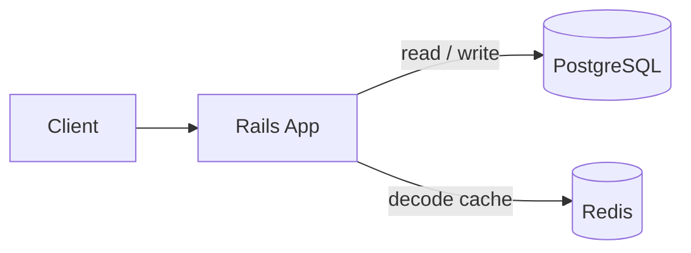
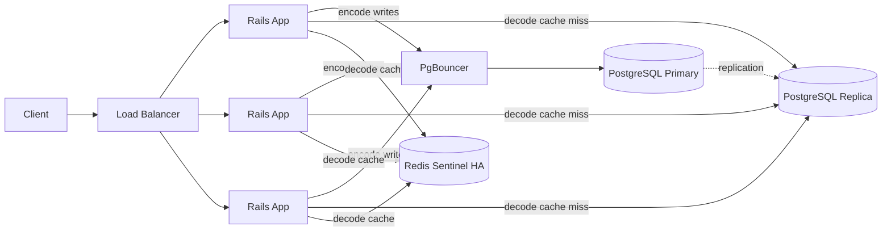
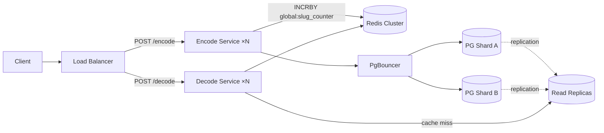

# URL Shortener

A Ruby on Rails JSON API that shortens URLs and resolves them back to the original.

- `POST /encode` — shorten a long URL; returns a short link
- `POST /decode` — resolve a short link (or just the slug) back to the original URL
- Mappings persist in **PostgreSQL** and survive restarts; **Redis** sits in front as a decode cache

**Live demo (Fly.io):** [https://bitly-clone-assignment.fly.dev/](https://bitly-clone-assignment.fly.dev/) · health: [/up](https://bitly-clone-assignment.fly.dev/up)

**Run locally:** `docker compose up --build` — full instructions in [SETUP.md](SETUP.md)

---

## Quick start

```bash
# Shorten a URL
curl -X POST https://bitly-clone-assignment.fly.dev/encode \
  -H 'Content-Type: application/json' \
  -d '{"url":"https://example.com/long/path"}'
# → {"shortened_link":"https://bitly-clone-assignment.fly.dev/<slug>"}

# Resolve it back (replace <slug> with the value from the encode response)
curl -X POST https://bitly-clone-assignment.fly.dev/decode \
  -H 'Content-Type: application/json' \
  -d '{"url":"https://bitly-clone-assignment.fly.dev/<slug>"}'
# → {"original_link":"https://example.com/long/path"}
```

For local runs, use `http://localhost:3000` — see [SETUP.md](SETUP.md).

---

## API

| Method | Path | Request body | Success response |
|--------|------|--------------|------------------|
| `POST` | `/encode` | `{ "url": "<long-url>" }` | `{ "shortened_link": "<base>/<slug>" }` |
| `POST` | `/decode` | `{ "url": "<short-url-or-slug>" }` | `{ "original_link": "<original-url>" }` |

**Status codes:**

| Code | Meaning |
|------|---------|
| `200` | Success |
| `422` | Missing or invalid `url` parameter |
| `404` | Slug not found (decode only) |

**Why `POST` for both:** keeps a uniform JSON-over-HTTP interface (same `Content-Type`, same `url` field shape), avoids long URLs in query strings and query-length limits.

Set `PUBLIC_APP_ROOT` in production to control the base URL returned in `shortened_link` (otherwise the request host is used).

---

## Design

### Slug generation and uniqueness

**Current implementation:** each row gets a numeric primary key `id`. On insert, `Base62(id)` is stored as `slug` (unique index). Same long URL → same record → same slug (`original_url` unique constraint).

**The enumeration problem:** `Base62(id)` is fully reversible. Knowing one slug → decode to `id` → iterate `id ± 1` → re-encode → enumerate every URL in the database. URL shorteners often store sensitive destinations (invite tokens, private share links, credentials in query strings) — the slug must be unguessable, not just short.

**Phase 1 upgrade — HMAC-based slug:**

```
slug = Base58( HMAC-SHA256(secret_key, id.to_s) )[0, 10]
```

- Uses the existing DB `id` as input — no new dependencies, no coordination needed
- 10 chars, Base58 alphabet (drops 0/O/I/l to avoid visual ambiguity)
- `secret_key` stored in Rails credentials; makes slugs undeducible even if the `id` sequence is known
- On UNIQUE conflict: retry with `HMAC(secret_key, "#{id}:#{attempt}")`
- **UNIQUE constraint + retry-on-conflict remains the correctness guarantee**

**Phase 3 upgrade — Snowflake-style ID:**

When writes shard across multiple Postgres primaries there is no single auto-increment `id`. Use a 64-bit composite:

```
[ 41-bit timestamp ms ][ 10-bit machine_id ][ 13-bit random ]
```

Encode to Base58 (~11 chars). Each instance mints IDs independently — no coordination per request. Removes the Redis counter dependency. UNIQUE constraint still present as a safety net.

**Collision at scale:**

| Slug | Key space | Collision rate @ 12B records | Expected pairs |
|------|-----------|------------------------------|----------------|
| 8-char Base58 | 58⁸ ≈ 1.28 × 10¹⁴ | 1 in 10,000 | ~562,500 |
| 10-char Base58 | 58¹⁰ ≈ 4.3 × 10¹⁷ | 1 in 35M | ~167 |

8 chars causes retry storms at scale. 10 chars is the sweet spot for 10–100B records. UNIQUE + retry is mandatory at both lengths.

**Migration:** old Base62 slugs shared externally must stay decodable — on decode, try the new scheme first and fall back to legacy `Base62` for slugs created before the migration.

### Persistence after restart

PostgreSQL is the source of truth. Redis is a cache only — if it restarts or evicts entries, `POST /decode` still resolves from Postgres and repopulates the cache on the next hit.

### Decode cache (Redis)

The `url` field on `/decode` accepts the full short URL or just the slug; the service extracts the path segment before the cache lookup.

1. **Read from Redis** (`shortlink:v1:<slug>`).
2. **Cache miss:** load from Postgres, then write back to Redis.
3. **After encode:** write-through to Redis so the next decode is fast.

**LRU alignment:** each cache hit refreshes the key's TTL (`EXPIRE`), so frequently resolved slugs stay warm. Docker Compose runs Redis with `allkeys-lru` + `maxmemory 128mb`. Fly's Upstash Redis is created with `--enable-eviction` (see [SETUP.md — Fly.io Redis LRU](SETUP.md#flyio-redis-lru-and-eviction)).

---

## Scaling

Target: **10k–100k requests/sec**, read-heavy traffic. Decode vastly outnumbers encode (a single viral link can generate millions of hits), so every phase optimizes the read path first.

### Phase 1 — current state (~1k RPS)



Single app instance. Postgres handles everything. Redis caches decode. This is what's deployed today.

### Phase 2 — horizontal read scaling (~1k–10k RPS)



Rails is stateless — scale out horizontally. PgBouncer handles connection pooling (many app threads, few Postgres connections). Decode cache misses go to the read replica instead of the primary. Redis Sentinel provides failover so the cache stays up.

**Tradeoffs:** PgBouncer adds ops complexity. The read replica has replication lag — newly encoded slugs have a short window where decode may miss the replica and fall back to the primary. Acceptable since encode is idempotent and rare.

### Phase 3 — split services + sharded writes (~10k–100k RPS)



Encode and decode are split into separate services — decode scales independently without over-provisioning write capacity. Postgres write path shards across multiple primaries.

**Centralized counter (range leasing):** each encoder calls `INCRBY global:slug_counter 1000` on the shared Redis Cluster key — claims a batch of 1000 IDs atomically in one network hop. It then mints slugs locally from that batch with no further coordination. Counter traffic is ~0.1% of encode volume. Encode is the only path that depends on the counter key; decode is unaffected if the key is temporarily unavailable.

**Tradeoffs:** encode now depends on Redis for ID allocation — mitigated by Redis Cluster HA. On service restart, the unused remainder of a batch is abandoned, leaving gaps in the ID sequence. Gaps in slugs are harmless; the `UNIQUE` index on `slug` remains the correctness guarantee.

**Alternative — Snowflake-style IDs** remove the Redis counter dependency entirely: each encoder mints its own 64-bit ID (`[timestamp][machine_id][random]`) with no coordination. See [Slug generation](#slug-generation-and-uniqueness) for the full comparison.

### Monitoring

Grouped by layer — each metric should feed into dashboards and drive alerts in a live environment.

**Cache (Redis)**
| Metric | Why it matters | Alert threshold |
|--------|---------------|-----------------|
| Hit rate | Primary health indicator — a drop signals cold start, eviction storm, or Redis failure | < 85% |
| Eviction rate | Keys dropped under memory pressure — high rate means Redis is undersized or TTL needs tuning | any sustained spike |
| Memory usage | Approaching `maxmemory` cap is a warning before evictions start | > 80% of cap |
| Connection pool wait | Blocked threads waiting for a Redis connection indicate pool exhaustion | > 0 |

**Database (Postgres)**
| Metric | Why it matters | Alert threshold |
|--------|---------------|-----------------|
| Replication lag | In Phase 2/3, decode misses hit the replica — high lag means freshly encoded slugs can't be decoded yet | > 5 s |
| Query latency p95 / p99 | Track encode and decode queries separately; they have different access patterns | > 50 ms p99 |
| Connection count | With PgBouncer, watch both Postgres connections and PgBouncer queue depth | queue depth > 0 |
| Slow query log | Catches unindexed access early; `slug` and `original_url` indexes should keep lookups O(log n) | any query > 100 ms |

**Application (Rails)**
| Metric | Why it matters | Alert threshold |
|--------|---------------|-----------------|
| Request rate by endpoint | Encode vs decode split reveals traffic shape; an encode spike may indicate abuse | encode rate anomaly |
| Error rate by status | 422 (bad input), 404 (unknown slug), 500 (app crash) — each has a different root cause | 500 rate > 0.1% |
| Response latency p50 / p99 | Decode should be faster than encode (cache hit); divergence signals a cache or DB problem | p99 > 100 ms |
| Thread pool saturation | Puma threads maxed means requests are queuing; scale out or tune thread count | saturation > 80% |

---

## Security

**Threat model:** the API accepts arbitrary URLs from unauthenticated clients and stores them permanently. The attack surface splits into two layers: inputs to this service (crafted payloads, abusive traffic, enumeration) and downstream effects on end users who follow shortened links to destinations this service does not control.

| Risk | Mitigation | Status |
|------|------------|--------|
| **Open redirect / phishing** — short links hide destinations | Scheme restricted to `http`/`https`; max URL length 2048 chars | ✓ in code |
| **Malicious URL content** — any valid URL is shortened regardless of destination | No content validation today; production: Safe Browsing API or blocklist check on encode | future |
| **Unauthenticated access** — any client can encode/decode without credentials | Acceptable for a demo; production: API keys or token auth to prevent bulk abuse | future |
| **Enumeration** — sequential slugs make all stored URLs discoverable by iteration | Phase 1: migrate to HMAC-based non-sequential slugs (see [Design](#design)); production: rate limiting + anomaly detection | partial |
| **DoS** — large payloads or high-volume traffic | Max URL length enforced in the model; rate limiting at the edge | partial |
| **Injection** — malicious inputs in queries or logs | Parameterized queries throughout; no server-side URL fetching (eliminates SSRF) | ✓ in code |
| **Log exposure** — full URLs appear in access logs | Redact or sample JSON request bodies in production log config | production |

---

## Testing

Request specs cover both endpoints at the HTTP layer: happy path, idempotent encode, invalid input (422), and unknown slug (404). Service specs cover `DecodeCache` and `ShortLinkParser`.

```bash
bundle exec rspec
```

Full setup and test commands (Docker, host Ruby, env vars): [SETUP.md](SETUP.md).

---

## Tech stack

- **Ruby 3.2.x** · **Rails 8.1.x** (API mode) — see [`.ruby-version`](.ruby-version)
- **PostgreSQL** — `links` table; unique constraints on `slug` and `original_url`
- **Redis** — decode cache only; non-authoritative (optional; app degrades gracefully without it)
- **Docker Compose** — app + Postgres + Redis for local development
- **RSpec** — request specs ([`spec/requests/`](spec/requests/)) and service specs ([`spec/services/`](spec/services/))
