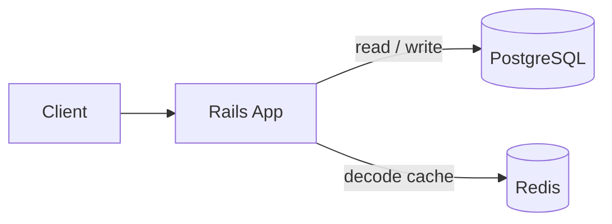
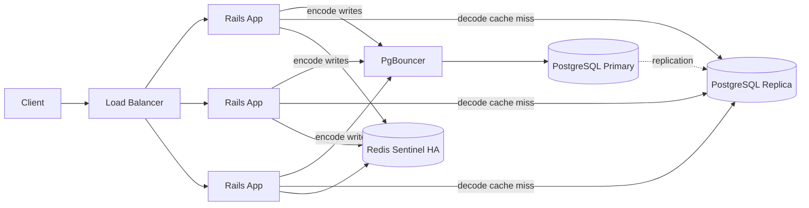
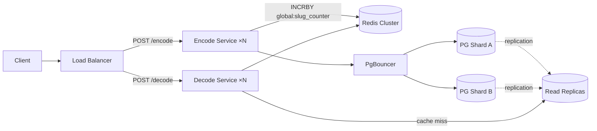

# URL Shortener

A Ruby on Rails JSON API that shortens URLs and resolves them back to the original.

- `POST /encode` — shorten a long URL; returns a short link
- `POST /decode` — resolve a short link (or just the slug) back to the original URL
- Mappings persist in **PostgreSQL** and survive restarts; **Redis** sits in front as a decode cache

**Live demo (Fly.io):** [https://bitly-clone-assignment.fly.dev/](https://bitly-clone-assignment.fly.dev/) · health: [/up](https://bitly-clone-assignment.fly.dev/up)

---

## Quick start

```bash
# Shorten a URL
curl -X POST https://bitly-clone-assignment.fly.dev/encode \
  -H 'Content-Type: application/json' \
  -d '{"url":"https://example.com/long/path"}'
# → {"shortened_link":"https://bitly-clone-assignment.fly.dev/1"}

# Resolve it back
curl -X POST https://bitly-clone-assignment.fly.dev/decode \
  -H 'Content-Type: application/json' \
  -d '{"url":"https://bitly-clone-assignment.fly.dev/1"}'
# → {"original_link":"https://example.com/long/path"}
```

Replace the slug with the value from your encode response. For local runs, use `http://localhost:3000` — see [SETUP.md](SETUP.md).

---

## API

| Method | Path | Request body | Success response |
|--------|------|--------------|------------------|
| `POST` | `/encode` | `{ "url": "<long-url>" }` | `{ "shortened_link": "<base>/<slug>" }` |
| `POST` | `/decode` | `{ "url": "<short-url-or-slug>" }` | `{ "original_link": "<original-url>" }` |

**Status codes:**

| Code | Meaning |
|------|---------|
| `200` | Success |
| `422` | Missing or invalid `url` parameter |
| `404` | Slug not found (decode only) |

**Why `POST` for both:** keeps a uniform JSON-over-HTTP interface (same `Content-Type`, same `url` field shape), avoids long URLs in query strings and query-length limits.

Set `PUBLIC_APP_ROOT` in production to control the base URL returned in `shortened_link` (otherwise the request host is used).

---

## Design

### Slug generation and uniqueness

Each row in the `links` table gets a numeric primary key `id` assigned by Postgres. After insert, the app Base62-encodes that `id` and stores it as `slug` (with a `UNIQUE` index).

- **No collisions:** Postgres `id` values are monotonically unique. `Base62(id)` is injective — two different rows cannot produce the same slug. The `UNIQUE` index on `slug` enforces this as a belt-and-suspenders constraint.
- **Idempotent encode:** `original_url` also carries a `UNIQUE` constraint. Submitting the same long URL twice returns the same record and the same slug.
- **Drawback:** slugs correlate with insertion order and are guessable. Production mitigations (rate limiting, anomaly detection, opaque random tokens) are documented in [Security](#security).

### Persistence after restart

PostgreSQL is the source of truth. Redis is a cache only — if it restarts or evicts entries, `POST /decode` still resolves from Postgres and repopulates the cache on the next hit.

### Decode cache (Redis)

1. **Read from Redis** (`shortlink:v1:<slug>`).
2. **Cache miss:** load from Postgres, then write back to Redis.
3. **After encode:** write-through to Redis so the next decode is fast.

**LRU alignment:** each cache hit refreshes the key's TTL (`EXPIRE`), so frequently resolved slugs stay warm. Docker Compose runs Redis with `allkeys-lru` + `maxmemory 128mb`. Fly's Upstash Redis is created with `--enable-eviction` (see [SETUP.md — Fly.io Redis LRU](SETUP.md#flyio-redis-lru-and-eviction)).

---

## Scaling

Target: **10k–100k requests/sec**, read-heavy traffic. Decode vastly outnumbers encode (a single viral link can generate millions of hits), so every phase optimizes the read path first.

### Phase 1 — current state (~1k RPS)



Single app instance. Postgres handles everything. Redis caches decode. This is what's deployed today.

### Phase 2 — horizontal read scaling (~1k–10k RPS)



Rails is stateless — scale out horizontally. PgBouncer handles connection pooling (many app threads, few Postgres connections). Decode cache misses go to the read replica instead of the primary. Redis Sentinel provides failover so the cache stays up.

**Tradeoffs:** PgBouncer adds ops complexity. The read replica has replication lag — newly encoded slugs have a short window where decode may miss the replica and fall back to the primary. Acceptable since encode is idempotent and rare.

### Phase 3 — split services + sharded writes (~10k–100k RPS)



Encode and decode are split into separate services — decode scales independently without over-provisioning write capacity. Postgres write path shards across multiple primaries.

**Centralized counter (range leasing):** each encoder calls `INCRBY global:slug_counter 1000` on the shared Redis Cluster key — claims a batch of 1000 IDs atomically in one network hop. It then mints slugs locally from that batch with no further coordination. Counter traffic is ~0.1% of encode volume. Encode is the only path that depends on the counter key; decode is unaffected if the key is temporarily unavailable.

**Tradeoffs:** encode now depends on Redis for ID allocation — mitigated by Redis Cluster HA. On service restart, the unused remainder of a batch is abandoned, leaving gaps in the ID sequence. Gaps in Base62 slugs are harmless; the `UNIQUE` index on `slug` remains the correctness guarantee.

### Monitoring

Redis hit rate, eviction count, cache-miss latency, Postgres replication lag, Postgres query time per shard.

---

## Security

| Risk | Mitigation |
|------|------------|
| **Open redirect / phishing** — short links hide destinations | Scheme restricted to `http`/`https`; max URL length enforced (2048 chars); future: user warnings, blocklists |
| **Enumeration** — sequential slugs are guessable | Documented; production: rate limiting + anomaly detection |
| **DoS** — large bodies or abusive traffic | Max URL length validation; rate limiting at edge in production |
| **Injection** — malicious inputs in logs or queries | Parameterized queries throughout; no server-side URL fetching (no SSRF vector) |
| **Log exposure** — URLs appear in access logs | Redact or sample JSON bodies in production logging |

---

## Testing

Request specs cover both endpoints at the HTTP layer: happy path, idempotent encode, invalid input (422), and unknown slug (404). Service specs cover `DecodeCache` and `ShortLinkParser`.

```bash
bundle exec rspec
```

Full setup and test commands (Docker, host Ruby, env vars): [SETUP.md](SETUP.md).

---

## Tech stack

- **Ruby 3.2.x** · **Rails 8.1.x** (API mode) — see [`.ruby-version`](.ruby-version)
- **PostgreSQL** — `links` table; unique constraints on `slug` and `original_url`
- **Redis** — decode cache only; non-authoritative (optional; app degrades gracefully without it)
- **Docker Compose** — app + Postgres + Redis for local development
- **RSpec** — request specs ([`spec/requests/`](spec/requests/)) and service specs ([`spec/services/`](spec/services/))
